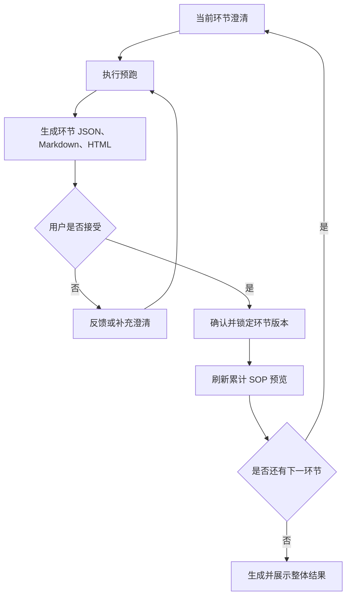

# W+ SOP 环节级增量产物

## Summary

W+ SOP 在每次环节预跑成功后生成当前环节的 JSON、Markdown 和 HTML 报告，允许用户围绕报告继续反馈、澄清和预跑。用户确认环节后锁定其接受版本，并立即将它纳入可预览的累计 SOP；最后一个环节确认后展示带整体摘要的完整结果。

---

## Problem Frame

当前流程在环节预跑结束后主要展示脱敏执行结果，完整 SOP 产物集中到所有环节结束后生成。用户虽然能判断一次预跑是否符合预期，却缺少一份可以直接审阅的“当前环节 SOP”来发现步骤、口径、输入输出或异常处理是否仍有缺口。

这使环节验收与最终文档生成相隔过远：问题可能直到最终结果出现时才暴露，用户也无法在推进过程中看到已确认内容如何逐步形成整体 SOP。

图示用于说明用户流程；下方文字需求为最终依据。

---

## Actors

- A1. SOP 用户：回答澄清问题、审阅环节报告、反馈预跑结果并确认环节。
- A2. W+ SOP Agent：结合已确认信息执行预跑，并生成环节报告和最终整体结果。
- A3. W+ 工作台：展示当前环节、报告版本、累计结果和可执行操作，并维护顺序流程边界。

---

## Key Flows

- F1. 环节报告迭代
  - **Trigger:** 当前环节完成一次成功预跑。
  - **Actors:** A1, A2, A3
  - **Steps:** Agent 生成三种格式的环节报告；工作台展示最新报告；用户选择确认，或提交反馈并继续澄清、再次预跑；每次成功重跑形成新的报告版本。
  - **Outcome:** 当前环节拥有一个可验收的最新报告版本，且用户仍停留在当前环节。
  - **Covered by:** R1, R2, R3, R4, R5

- F2. 环节确认与累计更新
  - **Trigger:** 用户确认当前环节的最新报告。
  - **Actors:** A1, A3
  - **Steps:** 工作台锁定接受版本；将该版本纳入累计 SOP；刷新累计 JSON、Markdown 和 HTML；确认更新成功后进入下一环节。
  - **Outcome:** 已确认内容立即出现在累计预览中，当前环节不能再次打开。
  - **Covered by:** R6, R7, R8, R9

- F3. 整体结果交付
  - **Trigger:** 最后一个环节被确认并成功纳入累计 SOP。
  - **Actors:** A1, A2, A3
  - **Steps:** 系统基于全部已确认环节生成整体摘要、封面或目录；展示最终 JSON、Markdown 和 HTML；用户确认整体结果后继续现有的记忆授权流程。
  - **Outcome:** 用户获得结构完整、与各环节已确认版本一致的整体 SOP。
  - **Covered by:** R10, R11, R12

---

## Requirements

**环节报告生成与迭代**

- R1. 每次当前环节的预跑成功完成后，系统必须生成同一内容语义下的环节 JSON、Markdown 和 HTML 报告。
- R2. 环节报告必须覆盖当前环节的目标、适用范围、已确认输入、执行步骤、能力或操作、结果结构、异常与限制，以及本轮预跑证据。
- R3. 三种格式全部生成并通过必要校验后，工作台才能把本轮报告标记为可验收；预跑或产物生成失败时不得形成可确认版本。
- R4. 在环节确认前，用户可以基于最新报告提交反馈、补充澄清并再次预跑；一次成功重跑必须形成新的环节报告版本并替代默认预览。
- R5. 同一环节的历史报告版本必须保留用于审计，工作台默认展示最新版本，并明确区分最新版本和已被取代的历史版本。

**确认与累计 SOP**

- R6. 用户确认当前环节时，系统必须锁定该环节的最新可验收版本；确认后不能重新打开、修订或重新预跑该环节。
- R7. 当前环节只有在其接受版本被锁定后才能进入下一环节，不能并行推进或跳过未确认环节。
- R8. 每次环节确认后，系统必须刷新累计 JSON、Markdown 和 HTML；累计正文只在后续环节的 SOP 确认页作为辅助上下文展示，不在澄清、预跑或生成过程中常驻展示。
- R9. 累计 SOP 只能包含各环节已确认的接受版本；当前未确认报告和历史版本不得进入累计结果。

**最终结果**

- R10. 最后一个环节确认后，最终整体结果必须以最新累计 SOP 为内容基础，不能重新解释或静默改写各环节已经锁定的业务内容。
- R11. 最终结果必须在各环节内容之外提供整体层级的标题、目录、跨环节摘要和完整执行顺序，使其成为一份连贯 SOP，而不是若干报告的简单拼接。
- R12. 最终 JSON、Markdown 和 HTML 必须表达一致的环节顺序和内容版本；整体结果确认后，才进入现有记忆候选授权或完成流程。

---

## Acceptance Examples

- AE1. **Covers R1, R3.** 给定当前环节预跑成功，当三种报告中任一格式生成或校验失败时，工作台显示可恢复失败，不开放“确认本环节”。
- AE2. **Covers R4, R5.** 给定环节报告 v1 已展示，当用户提交反馈并完成再次预跑时，系统生成 v2、默认展示 v2，并保留 v1 作为只读历史。
- AE3. **Covers R6, R7.** 给定当前环节存在可验收报告，当用户确认该环节时，系统锁定当前版本并进入下一环节；之后不再提供重新打开该环节的操作。
- AE4. **Covers R8, R9.** 给定环节 1 已确认且环节 2 正在澄清或预跑，工作台不展示累计正文；当环节 2 进入 SOP 确认页时，累计预览只包含环节 1 的接受版本，不包含环节 2 的草稿报告。
- AE5. **Covers R10, R11, R12.** 给定最后一个环节完成确认，当最终结果生成时，三种整体格式包含相同顺序的全部已确认环节，并增加整体摘要和导航结构，但不改变已锁定环节内容。

---

## Success Criteria

- 用户能在进入下一环节前，直接通过环节报告发现问题并完成“反馈—澄清—预跑—再审阅”闭环。
- 用户只在需要做环节验收时看到阶段 SOP 和已确认环节的累计上下文，澄清与预跑页面保持聚焦当前任务。
- 最终整体结果与所有环节的接受版本一一对应，不包含未确认内容，也不会因最终组装产生静默改写。
- 后续规划可以据此确定状态、产物和恢复机制，而不需要重新发明环节确认、版本选择或累计展示行为。

---

## Scope Boundaries

- 不支持重新打开、修改或重新预跑已经确认的环节。
- 不自动使后续环节失效，也不引入跨环节依赖重算。
- 不允许在当前环节确认前进入下一环节。
- 不把未确认环节报告纳入累计 SOP。
- 不在每个环节执行记忆授权；记忆候选仍在整体结果确认后统一处理。
- 不在本需求中扩展到 `wplus-skill-builder` 的自动调用。

---

## Key Decisions

- 确认即锁定：以不可回退的顺序流程换取明确的版本边界和稳定的累计结果。
- 报告先于确认：环节报告是用户继续反馈和验收的工作材料，不等于环节已经完成。
- 累计结果即时可见：每次确认都刷新累计 SOP，降低最终阶段集中发现问题的风险。
- 接受版本驱动整体结果：历史版本用于审计，只有每个环节的接受版本参与整体组装。
- 最终结果不是机械拼接：增加整体摘要与导航，但不重新改写已锁定环节内容。

---

## Dependencies / Assumptions

- 现有 W+ 流程继续保持一次只处理一个当前环节，并以用户确认作为进入下一环节的唯一边界。
- 环节报告需要使用与最终 SOP 相容的内容模型，才能稳定形成累计和最终三种格式。
- 当前的预跑结果、产物校验、可恢复失败和实时状态能力可以继续作为环节报告生成的基础。
- 整体结果确认与记忆授权的既有顺序保持不变。

---

## Outstanding Questions

### Deferred to Planning

- [Affects R1, R8, R12][Technical] 如何保证环节级与累计级 JSON、Markdown、HTML 在重复生成和失败恢复后仍保持同一内容版本。
- [Affects R2, R10, R11][Technical] 哪些内容属于环节局部信息，哪些只能在最终整体层级生成，以避免最终组装静默改写已确认内容。
- [Affects R3, R8][Technical] 环节确认与累计产物刷新应如何形成一致的提交边界，使刷新失败时不会提前进入下一环节。
